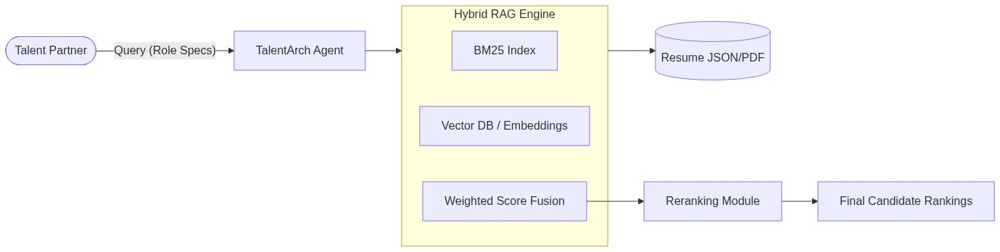
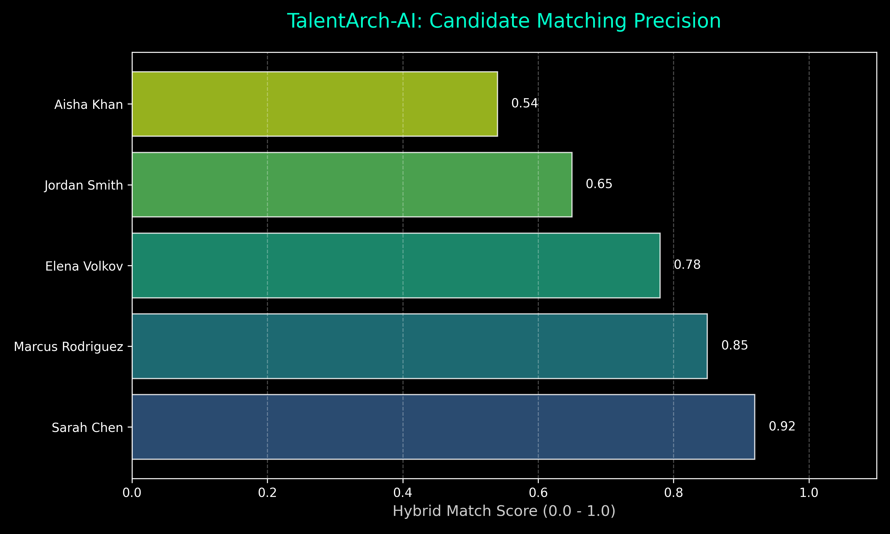
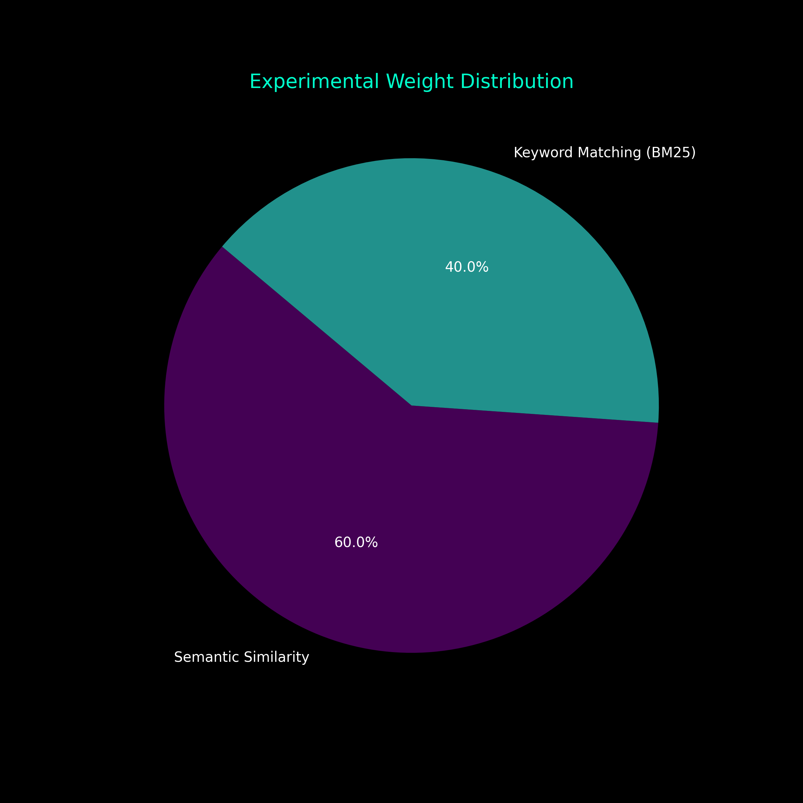

# TalentArch-AI: Architectural Talent Matching Agent

> **Subtitle: How I Automated Skill-First Technical Recruitment Using Hybrid-Search RAG and Score Fusion**


## Overview
TalentArch-AI is an experimental Proof of Concept (PoC) designed to solve the "needle in a haystack" problem in technical recruiting. By leveraging a **Hybrid-Search RAG** (Retrieval-Augmented Generation) pipeline, it combines the precision of keyword-based matching (identity-critical skills, tools, and certifications) with the depth of semantic retrieval (understanding context, seniority, and cultural fit).

This project demonstrates how a custom scoring engine can prioritize candidates by fusing scores from **BM25** (Keyword) and **Vector Similarity** (Semantic) algorithms.

## Key Features
- 🚀 **Hybrid Search Engine**: Dual-path retrieval combining BM25 and semantic context.
- 📊 **Statistical Matching**: Visual breakdown of candidate overlap vs. role requirements.
- 🛠️ **Score Fusion**: Configurable weights to prioritize exact skills or conceptual fit.
- 📜 **Mock Pipeline**: Ready-to-run environment with synthetic resume datasets.

## Architecture


### Retrieval Flow
1. **Keyword Path**: Uses BM25 to find exact matches for mandatory tech stacks (e.g., "Python", "Kubernetes").
2. **Semantic Path**: Analyzes candidate summaries to understand architectural seniority and domain expertise.
3. **Fusion**: A weighted linear combination merges these signals into a final "Architectural Fit" score.

## Let's Run
```bash
# Clone the repository
git clone https://github.com/aniket-work/talent-arch-ai.git
cd talent-arch-ai

# Initialize environment
python3 -m venv venv
source venv/bin/activate
pip install -r requirements.txt

# Execute the experiment
python talent_arch.py
```

### Sample Output
```text
[*] Initializing Hybrid Search for query: 'Cloud native engineer...'
[OK] Fusion Scoring Complete

CANDIDATE NAME            | ROLE                      | HYBRID SCORE
--------------------------------------------------------------------------------
Jordan Smith              | DevOps Engineer           | 0.82        
Sarah Chen                | Senior Fullstack Engineer | 0.6565      
```

## Statistical Analysis



---
*Disclaimer: This is an experimental PoC and not intended for production HR environments. All candidate data is synthetic.*
